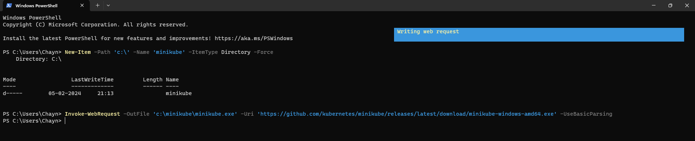

# minikube-windows

1 . It helps us to run k8 cluster in local machine
2 . Minikube runs a single-node kubernets cluster in local machine

Installation Steps : 
Download and run the installer for the latest release.
Or if using PowerShell, use this command:
'''
New-Item -Path 'c:\' -Name 'minikube' -ItemType Directory -Force
Invoke-WebRequest -OutFile 'c:\minikube\minikube.exe' -Uri 'https://github.com/kubernetes/minikube/releases/latest/download/minikube-windows-amd64.exe' -UseBasicParsing

