# Minikube for Windows


Minikube is a tool that enables you to run Kubernetes clusters locally on your Windows machine. It is particularly useful for development, testing, and learning Kubernetes concepts without needing access to a cloud or remote Kubernetes cluster.

Installation Steps
Download Kubectl

https://kubernetes.io/docs/tasks/tools/install-kubectl-windows/

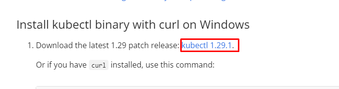

Download Minikube:
Download the Minikube installer for Windows from the latest release or use   to download and install:


```
New-Item -Path 'c:\' -Name 'minikube' -ItemType Directory -Force
Invoke-WebRequest -OutFile 'c:\minikube\minikube.exe' -Uri 'https://github.com/kubernetes/minikube/releases/latest/download/minikube-windows-amd64.exe' -UseBasicParsing
```

2) Set Environment Variables:
Set the Minikube and Kubectl  folder path in the environment variables:

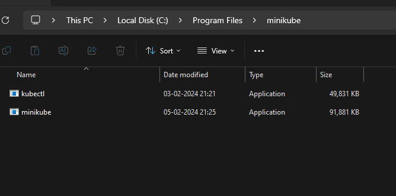

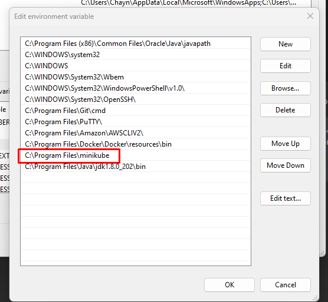


 
 
3) Make sure to run PowerShell as Administrator.
```
$oldPath = [Environment]::GetEnvironmentVariable('Path', [EnvironmentVariableTarget]::Machine)
if ($oldPath.Split(';') -inotcontains 'C:\minikube'){
[Environment]::SetEnvironmentVariable('Path', $('{0};C:\minikube' -f $oldPath), [EnvironmentVariableTarget]::Machine)
}
```

4) Start Docker Engine:
Ensure that the Docker engine is running on your machine.

Start Minikube:
Open CMD and run the following command to start Minikube using the Docker driver:
```
minikube start --driver=docker
```
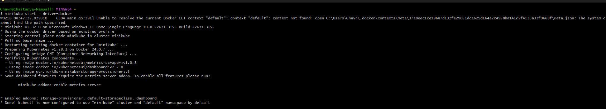

Check Status:
After Minikube has started successfully, check its status using below comand : 
```
minikube status
```
Usage
With Minikube running, you can now interact with your local Kubernetes cluster using kubectl commands. You can deploy, manage, and test your Kubernetes applications directly on your Windows machine.

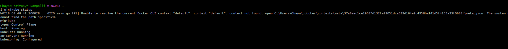

To get cluster details use below command :"

```
kubectl cluster-info
```

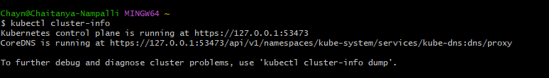

To get nodes infomation

```
kubectl get nodes
```

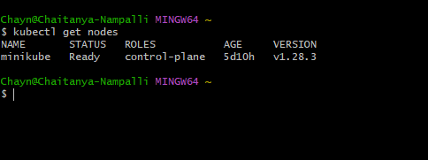


All Set now we are using local docker to communicate with minikube so we have to use below command

```
minikube docker-env
```


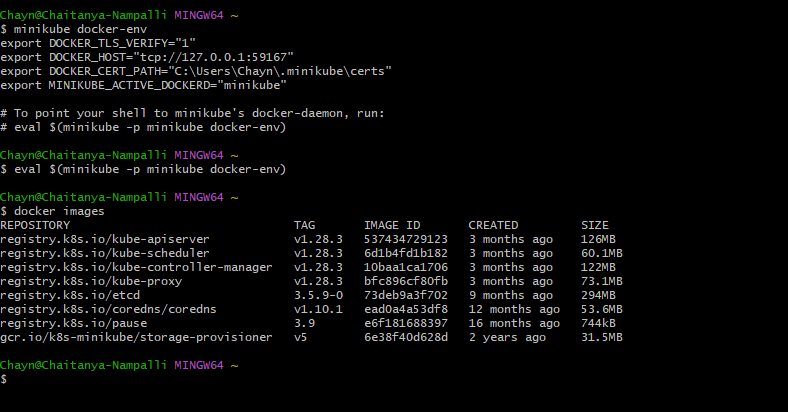
--------------------------------


Now Create a docker image in my case am using 2048-game image 

Replo link :- https://github.com/chaitanya-online/2048-game

After cloning repo goto directory of repo in local machine and type below command

```

docker build -t richeb/2048-game .
```

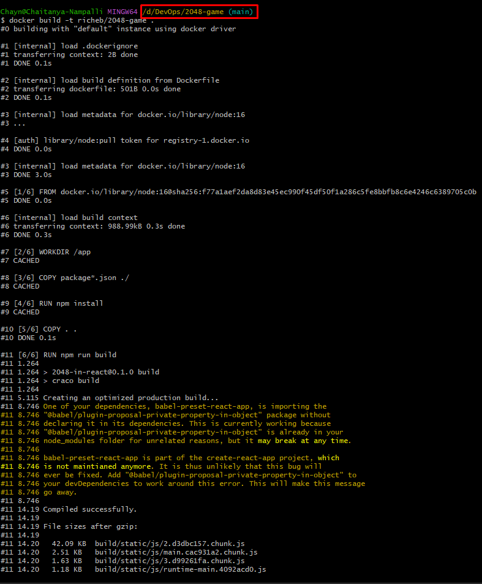

----------------------------------

Now After successfully building the docker file have to apply manifest file
Check manifest.yaml in root directory of this Repo


```
kubectl apply -f manifest.yaml
```

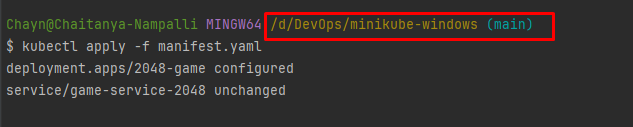


Check status by using  below command

```
kubectl get pods
```

```
kubectl logs <pod name>
```

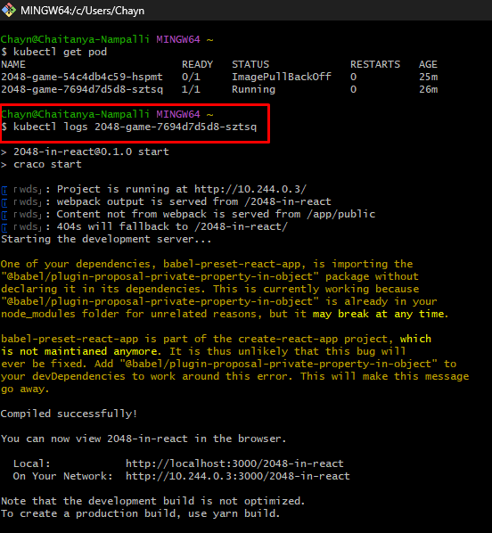

----------------------------------

Check ip by using  below commands

```
kubectl get svc
```

```
minikube service game-service-2048 --url
```

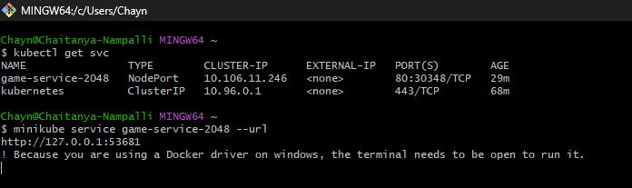

Now access the application in browser by using

http://127.0.0.1:53349/

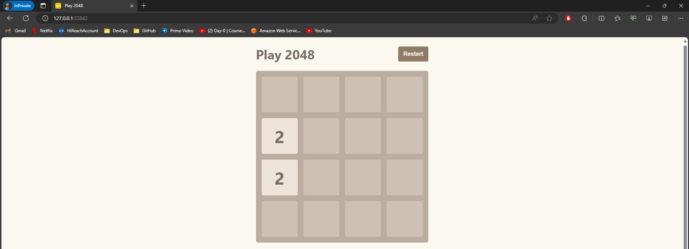

--------------


To See the Full Dashboard

```
minikube dashboard
```


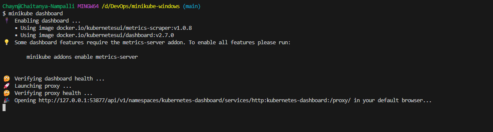

http://127.0.0.1:53877/api/v1/namespaces/kubernetes-dashboard/services/http:kubernetes-dashboard:/proxy/#/workloads?namespace=default

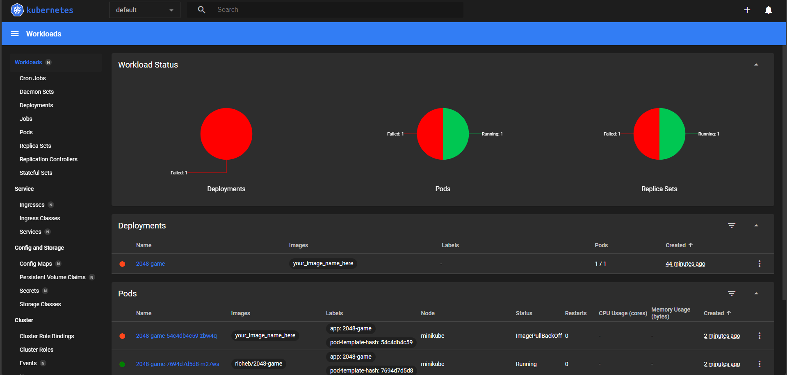


Enjoy exploring and learning Kubernetes with Minikube!!
